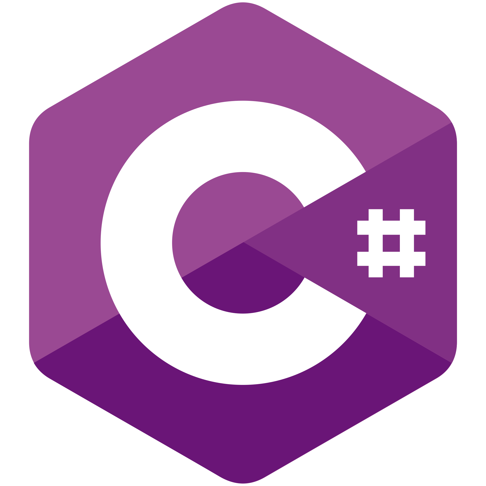
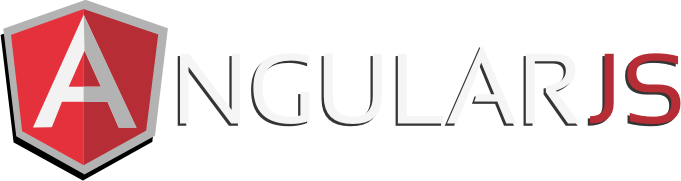

<h1 align="center">
  
</h1>

<h5 align="center">
  <code><a href="https://www.linkedin.com/company/seemon" title="LinkedIn Profile"> LinkedIn</a></code>
</code>
  <code><a href="https://www.instagram.com/seemon_tech" title="Instagram Profile"> Instagram</a></code>
</h5>
 

  Hi, We're 🧠 Commercial open source software company on multimodal AI platform.
   
   
  🚀 Founded in Mar. 2023, raised 200K AED in 1 months; now a global team of 65 with fWhere we are now?.
   
  🏆 One of the high-potential AI startups in the world,.
   

💰 Competitive salary & ESOP stock options

🦄 Rapid career development opportunities alongside the company

🌎 Multi-cultural & diverse team

🎓 Numerous opportunities to top AI/OSS/industry conference

🏢 Modern office in the heart of Berlin, San Jose, Shenzhen, Beijing

⛱️ Free snacks & drinks, monthly team events, flexible working hours

💻 M1/M2 MacBook & top-notch equipment

<h2 align="center">🔥 Languages & Frameworks & Tools & Abilities 🔥</h2>
 

  <code></code>
  <code></code>
  <code></code>
  <code></code>
  <code></code>
  <code></code>
  <code></code>
  <code></code>
  <code></code>
  <code></code>
  <code></code>
  <code></code>
  <code></code>
  <code></code>
  <code></code>
  <code></code>
  <code></code>
  <code></code>
  <code></code>
  <code></code>
  <code></code>
  <code></code>
  <code></code>
  <code></code>
  <code></code>
  <code></code>
  <code></code>
  <code></code>
  <code></code>

<h2 align="center">⚡ Stats ⚡</h2>
 
  

    
  

   
